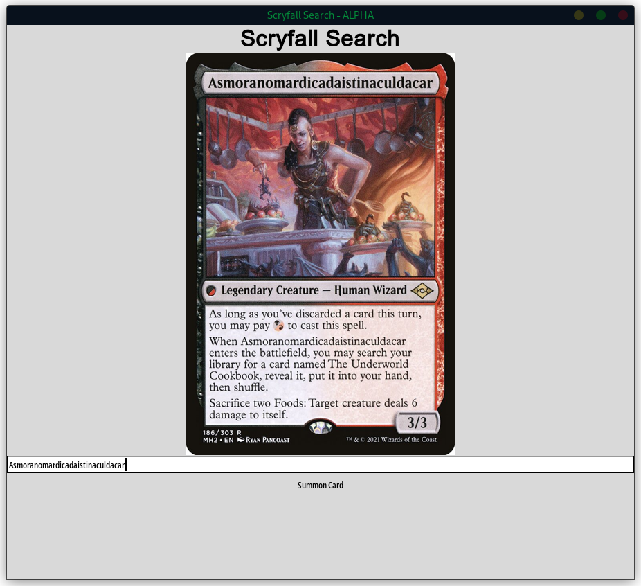

# Desktop Scryfall Search



This tool is my first attempt at building a GUI Python application. 

It parses the Scryfall API and does a fuzzy search for any Magic: The Gathering card.

## How to Run
You'll need to install a few things before this will run: 

```python
pip3 install pillow
pip3 install requests
```

## Known Issues
Currently, it does ***NOT*** work with double-sided cards. This will be fixed in future releases